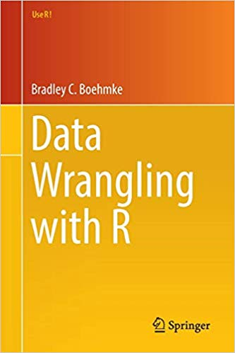

--- 
title: "R을 이용한 데이터 랭글링"
author: "이현열 (Henry Lee)"
site: bookdown::bookdown_site
output: bookdown::gitbook
documentclass: book
fontsize: 12pt
link-citations: yes
latex_engine: xelatex
github-repo: hyunyulhenry/data_wrangling
---

# Welcome {-}

본 페이지는 **R을 이용한 데이터 랭글링** 강의 페이지이며, 다음과 같은 내용으로 구성되었습니다.

- Part 1: 데이터 타입별 다루기
  - Chapter 1: Numbers
  - Chapter 2: Character Strings
  - Chapter 3: Factors
  - Chapter 4: Date
- Part 2: 데이터 구조 다루기
  - Chapter 5: Data Structure Basics
  - Chapter 6: Vector
  - Chapter 7: List
  - Chapter 8: Matrix
  - Chapter 9: Data Frame
  - Chapter 10: Missing Value
- Part 3: 데이터 불러오기 및 내보내기
  - Chapter 11: Import Data
  - Chapter 12: Exporting Data
- Part 4: 데이터 구조 변형하기
  - Chapter 13: 함수
  - Chapter 14: Loop Statement
  - Chapter 15: Pipe Operator (%>%)
- Part 5: 데이터 구조 변형하기
  - Chapter 16: tidyr을 이용한 데이터 모양 바꾸기
  - Chapter 17: dplyr을 이용한 데이터 변형하기

본 강의록의 대부분 내용은 *Bradley C. Boehmke*의 **Data Wrangling with R (Use R!)**을 참조하였습니다.

https://www.amazon.com/Data-Wrangling-R-Use/dp/3319455982

```{r echo = FALSE, out.width = '30%'}

```

## Contact Information {-}

- E-mail: leebisu@gmail.com
- Henry’s Quantopia: https://blog.naver.com/leebisu
- GitHub: https://github.com/hyunyulhenry/
